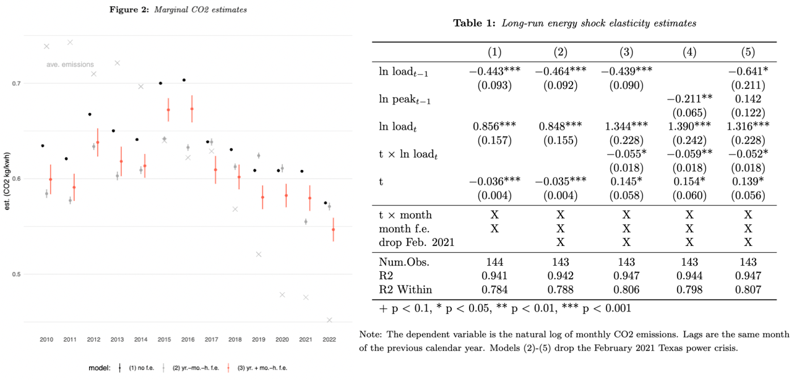

```{r setup, include=FALSE}
library(tufte)
# invalidate cache when the tufte version changes
knitr::opts_chunk$set(cache.extra = packageVersion('tufte'))
options(htmltools.dir.version = FALSE)
```

<!--- Aobe fonts -->
<link rel="stylesheet" href="https://use.typekit.net/vas8izs.css">
<!-- Google tag (gtag.js) -->
<script async src="https://www.googletagmanager.com/gtag/js?id=GA_TRACKING_ID"></script>
<script>
  window.dataLayer = window.dataLayer || [];
  function gtag(){window.dataLayer.push(arguments);}
  gtag('js', new Date());

  gtag('config', 'G-6TT0DM1BX3');
</script>
## [cv](https://www.dropbox.com/scl/fi/wqc9ny1b6t4ajq100w9ek/CV.pdf?rlkey=cxvbaoe21tyuhbi3rtdfan0s1&dl=0) ⋅ [research](#research) ⋅ [contact](#contact)
```{marginfigure}
<br><br><br>
```

I am an economist and a post-doc at [Yale School of the Environment](https://environment.yale.edu/). My research focuses on the microeconomics of energy and climate innovation: Who adopts new technologies and why? How can the government direct—and speed up—technical change? How do manufacturers and innovators respond to both policy and politics? I use a combination of economic modeling and causal inference to investigate these questions.

Prior to Yale, I was a research fellow at the Environmental Protection Agency where I worked on cars, including [light and medium-duty vehicle rule making](https://www.epa.gov/regulations-emissions-vehicles-and-engines/proposed-rule-multi-pollutant-emissions-standards-model), and environmental justice questions. I earned my Ph.D. in [Agricultural, Food, and Resource Economics](https://afre.msu.edu) at Michigan State University. I also hold degrees from The University of Chicago and Carnegie Mellon University. Before graduate school, I ran a small biofuel company^[[Details.](figs/details.png)] in Braddock, Pennsylvania.^[Now famously the home of Senator John Fetterman who was [mayor at the time.](https://www.rollingstone.com/culture/culture-features/john-fetterman-pennsylvania-mayor-hell-allegheny-county-100493/)]

I am on the job market. Here is my [research statment](https://www.dropbox.com/scl/fi/mrwu4gb3v0yous9xeilt8/Watten-Research-Statement.pdf?rlkey=fvhotxk52akobbm2psjrpgqe7&dl=0), and my [job market paper](https://www.dropbox.com/scl/fi/acxjy6un9a2efaabdjc27/Attributes_Watten_Anderson_Helfand.pdf?rlkey=l9uhir9a36qc63vhndw2ynfti&dl=0). 


# Upcoming/recent presentations

⋅ ASSA 2024 Annual Meeting - [Jan. 7 @ 8am](https://www.aeaweb.org/conference/2024/preliminary/1838?q=eNqrVipOLS7OzM8LqSxIVbKqhnGVrJQMlWp1lBKLi_OTQRwzJR2lktSiXFwgG8hKSayEMEoyc1MhrLLM1HKQAUUFBUABUwOl2lpcMGKVG78,)<br>
⋅ Yale Seminar in Environmental and Natural Resource Economics - Nov. 1<br>
⋅ NBER Economics of Energy Use in Transportation [[slides]](https://www.dropbox.com/scl/fi/stcehaxycwbwofk6izotu/Attributes-NBER.pdf?rlkey=7wpfb2f4ga2xgzu7rxd03lygh&dl=0)

# Research <a id="research"></a>

## Peer-reviewed

How is Rooftop Solar Capitalized in Home Prices? With Kenneth Gillingham.
R&R at Regional Science and Urban Economics.
[[Working paper]](https://www.dropbox.com/scl/fi/ccz50ie7jv95i76k1km8o/Gillingham-and-Watten-Solar-Capitalization.pdf?rlkey=36ity4d1svi1khopqssj9ni5r&dl=0)^[Key figure. Full solar capitalization assumes a high discount rate.<br>
<a href="figs/solar capitalization estimates.png"></a>
]

## Working papers 

Attribute Production and Technical Change in Automobiles. 2023.
With Soren Anderson and Gloria Helfand. [[NBER]](https://conference.nber.org/conf_papers/f178120.pdf)^[Key figure. Estimated technical change is substantially fuel-economy biased (left). Consumer preferences for size, acceleration, and fuel economy have all increased (right).<br>
<a href="figs/attributes_fig10.png"></a>
]

Political Risk Reduces Solar Adoption in Renewable Portfolio Standards. 2022.^[Dissertation chapter.] [[Slides]](https://www.dropbox.com/scl/fi/2k3e1eh86bsox7rnvmigz/Watten_AERE_2022.pdf?rlkey=wyhl3h35cfv05ia5gcoo4odn8&dl=0)

## Works in progress

The Marginal Benefits of Electrification Policy. With Soren Anderson and John Bistline.^[Electricity CO2 intensity increased before decreasing in ERCOT (top). Demand shocks are associated with above-trend cleaner electricity one year later (bottom).<br>
<a href="figs/co2_intense.png"></a>
<a href="figs/shock-elast.png"></a>
]

Technology Specific Subsidies and Policy Longevity.

Solar Households Catch the EV Wave. With Bryan Bollinger and Kenneth Gillingham.^[DOE grant funded.]

Green vs Grid-independence Messaging: Evidence from a Residential Battery Storage Field Experiment. With Bryan Bollinger and Kenneth Gillingham.^[Ibid.]

Against the Wind? Hedonic Estimation Under Attribute Uncertainty.

Dynamic Intraseasonal Farming Investment, Abandonment, and Climate Change.

# Contact <a id="contact"></a>

asa.watten + yale.edu <br>
Pronunciation: Ace-uh.

```{r date, echo=FALSE,comment=NA}
message("Last update: ",Sys.Date())
```


